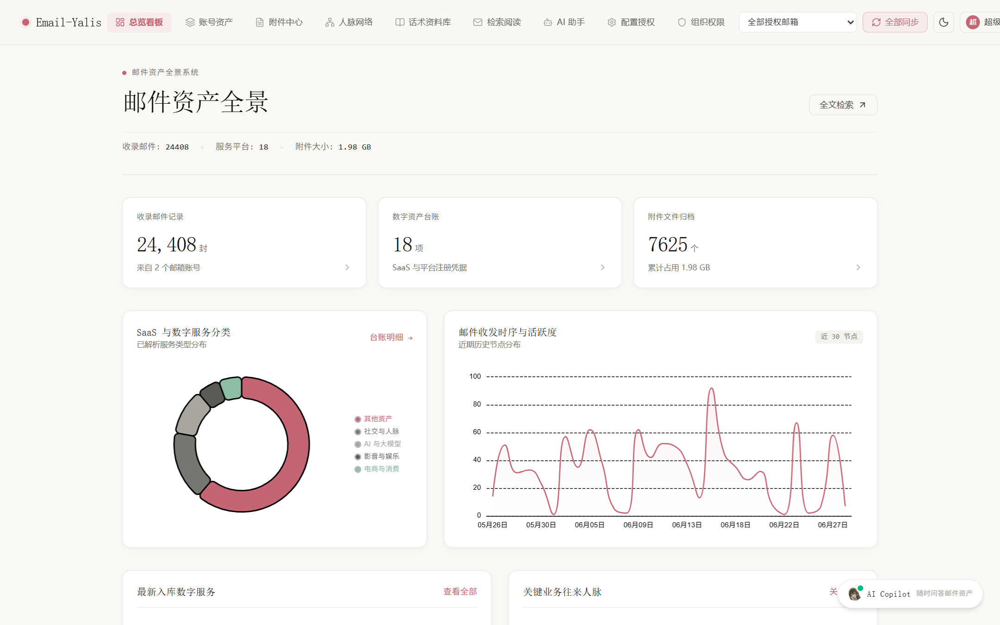
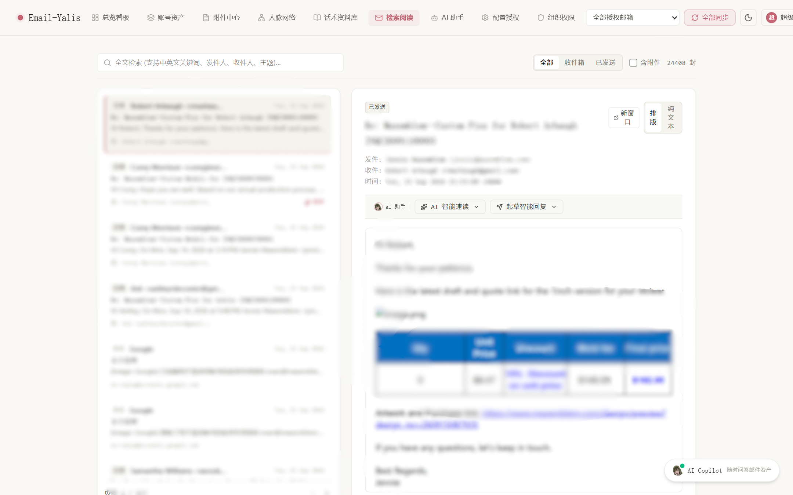
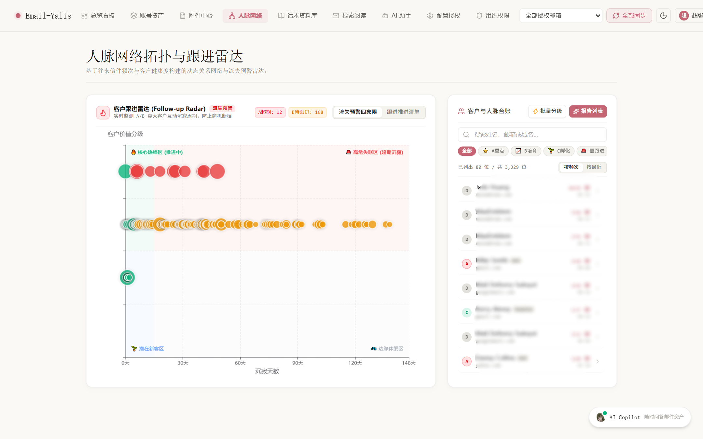
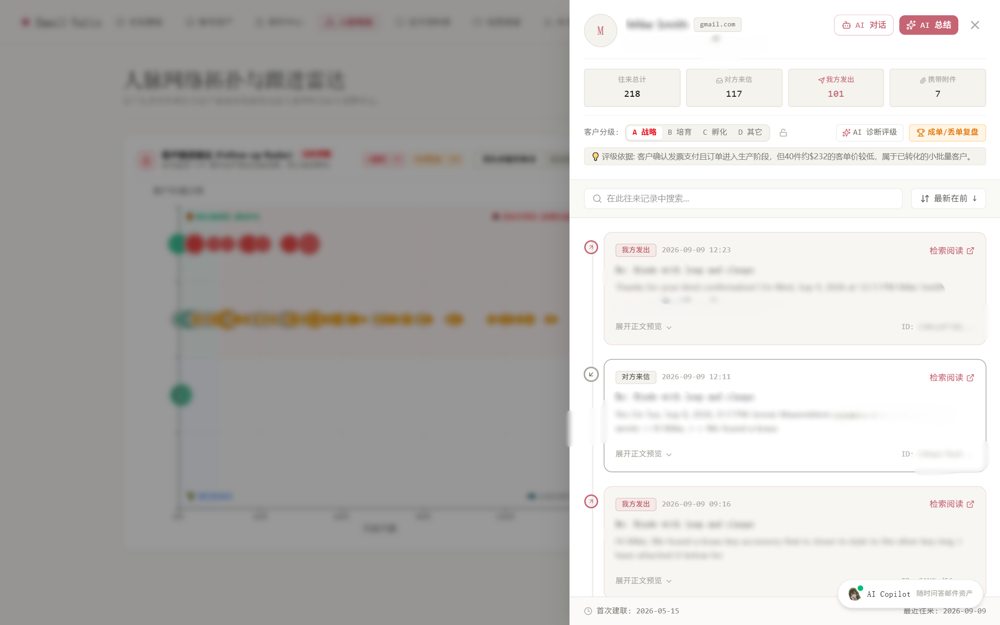
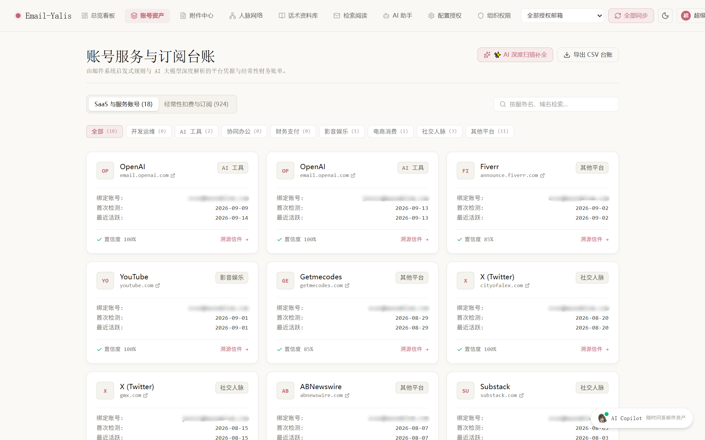
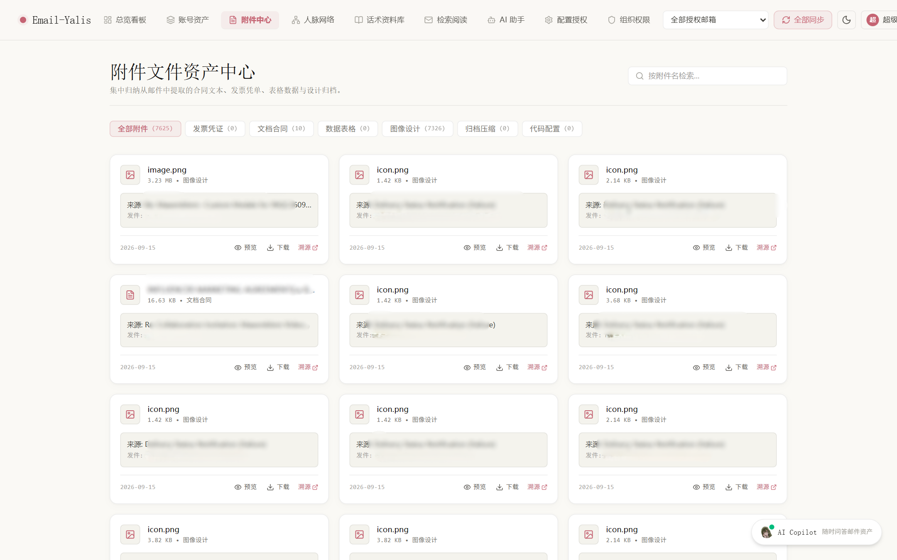
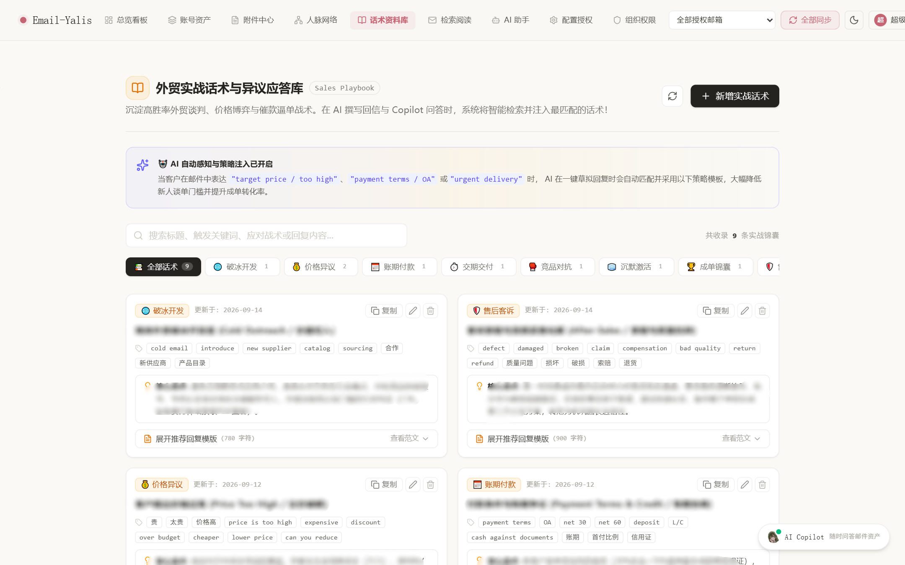
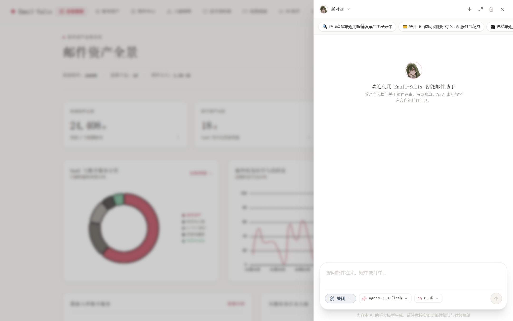
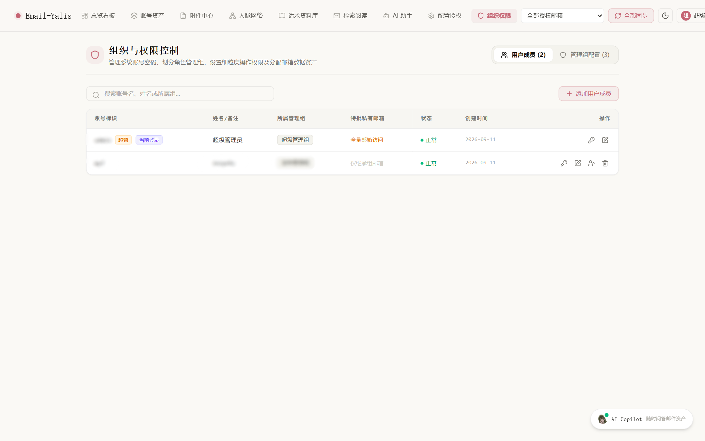
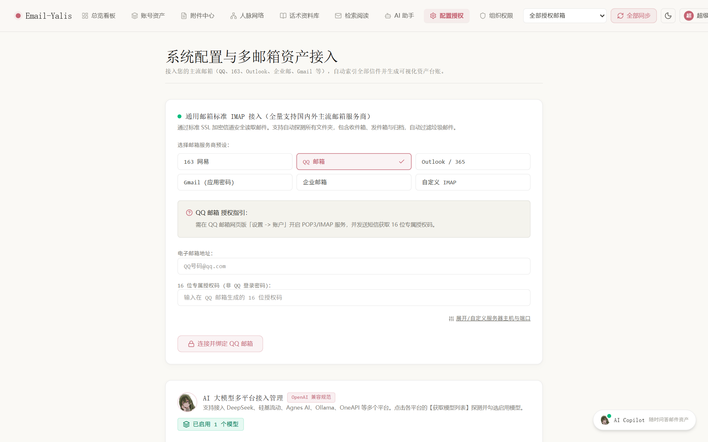

# Email-Yalis 邮件资产挖掘与业务协同管理系统

面向企业与个人的本地优先 (Local-First) 邮件资产管理平台。系统支持 Gmail REST API 与通用标准 IMAP 协议（QQ 邮箱、网易 163、Outlook/Office 365、企业邮箱等）进行多账号信件同步，在本地持久化归档与自动清洗。系统内置 SQLite FTS5 全文检索引擎、SaaS 账号与订阅台账挖掘、附件分类归档、客户跟进雷达与外贸实战话术库，并支持接入 DeepSeek 及兼容 OpenAI 规范的本地/云端大模型，实现智能速读、上下文引用追溯、自动草拟回复与全局 Copilot 工作台。

---

## 界面预览与核心功能

### 1. 邮件资产全景看板
集中呈现收录邮件量级、授权账号状态、SaaS 服务凭据与附件占用体量。提供邮件收发时序活跃度折线图与数字服务分类环形图，并支持快速查看最新入库服务与重点业务往来人脉。



### 2. 全能检索与双栏阅读器
内置 SQLite FTS5 中英文分词与全文检索引擎，支持按关键词、发件人、收件人、主题即时检索。提供全部、收件箱、已发送、含附件等多维筛选器，支持富文本 HTML 与纯文本排版无损切换，并提供新窗口独立阅读与 AI 智能速读快捷操作。



### 3. 客户跟进雷达与流失预警
基于客户往来信件频次与沉寂周期建立客户跟进雷达 (Follow-up Radar)，划分为核心热络区、高危失联区、潜在新客区、边缘休眠区四大象限。支持 A 战略、B 培育、C 孵化、D 其它等分级管理，针对超期未联系的重点客户进行实时预警。



### 4. 联系人业务画像与往来时间轴
点击任意联系人即可滑出往来全景抽屉，呈现双向信件收发量统计、附件清单、客户价值分级与评级依据。系统自动串联双方历史往来信件形成时间轴视图，支持一键发起 AI 业务诊断、成单复盘与全文溯源。



### 5. 数字资产与 SaaS 订阅台账
从全量邮件中通过模式匹配与规则引擎，自动挖掘第三方平台注册凭据、开发者账号、SaaS 服务及经常性扣费账单。自动识别 OpenAI、GitHub、AWS、Fiverr、X (Twitter)、Substack 等平台，计算置信度并关联原始凭据邮件，支持一键导出 CSV 台账。



### 6. 附件文件资产中心
集中提取并归档邮件附件，自动归类为发票凭证、文档合同、数据表格、图像设计、归档压缩与代码配置。支持按文件名快速检索、附件大小过滤、本地快速预览、下载以及反向定位原始邮件。



### 7. 外贸实战话术与异议应答库 (Sales Playbook)
沉淀高胜率外贸商务谈判、价格博弈、账期付款与交期协商等战术方案。覆盖破冰开发、价格异议、付款条件、交期交付、竞品对抗、沉默激活、售后客诉等多类场景，在邮件阅读与 Copilot 回复时可自动感知客户语义并直接调用策略模板。



### 8. 深度思考 AI 邮件助理工作台
深度集成大模型 API（支持 DeepSeek-R1、Agnes、Ollama、OneAPI 等），提供全屏工作台与全局浮动抽屉两种交互形态。具备思考过程展示、本地邮件全文检索工具调用（Tool Calling）、来源信件引用锚点（Cited References）与交互记忆能力。




### 9. 组织架构与细粒度权限控制 (RBAC)
内置多用户与组织角色体系，预设超级管理员（Superadmin）、业务管理组（Business Admin）、普通员工组（Normal Admin），支持自定义角色组、权限点勾选以及单用户专属邮箱授权隔离，保障团队协同与数据合规。



### 10. 系统配置与多协议接入中心
统一管理 Gmail OAuth 2.0 / 应用密码接入、通用 IMAP/SMTP 邮箱配置、定时自动增量同步周期、大模型接口参数与本地存储诊断。



---

## 核心特性

- 本地优先架构 (Local-First)：所有邮件数据、附件、索引台账均存储在本地 SQLite 数据库与磁盘文件中，不经由任何第三方中转，数据私密可控。
- 双协议同步引擎：
  - Gmail：支持 Google Cloud OAuth 2.0 官方 REST API，采用 HTTP Batch 批处理管道（单批次请求 50~100 封），结合 historyId 实现秒级增量同步；亦支持应用专用密码方式接入。
  - 通用 IMAP：支持 QQ 邮箱、网易 163 邮箱、Outlook / Office 365、企业邮箱及自建 IMAP 服务器，采用标准 SSL 加密传输与自动信箱探测。
- 后台增量巡检：提供可配置的定时轮询任务与实时 SSE (Server-Sent Events) 双向事件流推送，同步进度与日志在前端无感刷新。
- 本地搜索引擎：采用 SQLite 虚拟表与 FTS5 引擎，针对中英混排邮件正文、发件人、收件人和主题建立倒排索引，毫秒级响应海量信件检索。
- 大模型深度集成：兼容 OpenAI 规范 API，支持流式输出、CoT 思考链展开、工具链动态调用及引用溯源，适用于外贸信件润色、意向分析、订单追踪与自动草拟。

---

## 技术栈

| 领域 | 核心技术 / 库 | 说明 |
| :--- | :--- | :--- |
| 前端框架 | React 19 + Vite 8 | 现代组件化 UI 与轻量高效的前端构建打包工具链 |
| 样式与设计 | Tailwind CSS v4 + Lucide React | 原子化样式规范与 Yohaku 纸感排版设计体系 |
| 数据可视化 | Apache ECharts + echarts-for-react | 邮件时序折线图、SaaS 分类环形图与客户跟进四象限雷达散点图 |
| 文档与排版 | React-Markdown + Remark-GFM | 邮件正文 Markdown 渲染、表格规范支持与代码语法高亮 |
| 后端框架 | Python 3.10+ + FastAPI | 高性能异步 REST API 框架，基于 ASGI 异步标准规范构建 |
| Web 服务器 | Uvicorn (Standard) | 生产级高并发异步服务器，内置 uvloop 与 httptools 事件循环加速 |
| 数据持久化 | SQLite 3 + aiosqlite | 零外部依赖本地关系型数据库，轻量级非阻塞异步操作驱动 |
| 全文检索引擎 | SQLite FTS5 (Full-Text Search) | 内置虚拟表全文索引，毫秒级响应中英文多字段联合检索与高亮定位 |
| 邮件协议集成 | Google API Client + imaplib / httpx | Gmail REST API (HTTP Batch 批量拉取) 与通用 IMAP4 over SSL 适配 |
| AI 推理与调度 | OpenAI API 标准规范兼容层 | 统一对接 DeepSeek (R1/V3)、Agnes、Ollama、OneAPI，支持流式传输、CoT 思考链与函数调用 |
| 安全认证体系 | PBKDF2-HMAC-SHA256 + JWT | 动态 Salt 单向密码哈希、无状态 Token 鉴权与细粒度 RBAC 组织权限隔离 |

---

## 技术架构

```
Email-Yalis/
|-- backend/                     # Python 后端服务
|   |-- app/
|   |   |-- config.py            # 全局配置、环境变量与路径解析
|   |   |-- database.py          # SQLite 连接池、表结构迁移与 FTS5 索引初始化
|   |   |-- dependencies.py      # JWT 认证鉴权与邮箱访问权限依赖注入
|   |   |-- schemas.py           # Pydantic 请求与响应数据校验模型
|   |   |-- routers/             # REST API 路由层 (auth, sync, emails, contacts, assets, sales, ai, users 等)
|   |   `-- services/            # 核心业务服务层
|   |       |-- auth_service.py      # 用户密码加密、JWT 生成与组织架构管理
|   |       |-- gmail_auth.py        # Google OAuth2 流程与凭证持久化
|   |       |-- gmail_sync.py        # Gmail Batch 同步与增量拉取
|   |       |-- imap_sync.py         # 通用 IMAP SSL 同步实现
|   |       |-- auto_sync_service.py # 后台定时自动同步调度器
|   |       |-- asset_extractor.py   # 数字资产与财务扣费正则挖掘引擎
|   |       |-- sales_service.py     # 客户雷达四象限分布与话术库管理
|   |       |-- ai_service.py        # 大模型会话调度、记忆管理与流式响应
|   |       |-- ai_retrieval.py      # 针对邮件的本地向量/全文检索与上下文增强
|   |       `-- ai_tools.py          # 供大模型调用的查询与分析工具集
|   `-- run.py                   # 后端启动入口 (Uvicorn)
|-- frontend/                    # 前端工程 (React 19 + Vite 8)
|   |-- src/
|   |   |-- api/client.js        # Axios/Fetch 统一封装与错误拦截
|   |   |-- components/          # 公共组件 (Navbar, AI 抽屉, 阅读器, 模态框等)
|   |   |-- context/             # 全局状态 (AuthContext, AIConversationContext)
|   |   |-- pages/               # 九大业务视图页面
|   |   `-- styles/              # Yohaku 纸感设计体系与主题定义
|   |-- index.html
|   `-- vite.config.js
|-- docs/
|   `-- images/                  # 真实系统运行界面截图
|-- data/                        # 本地持久化数据目录 (运行时自动生成，已 gitignore)
|   |-- email_assets.db          # SQLite 数据库文件 (包含关系表与 FTS5 虚拟表)
|   `-- attachments/             # 本地附件去重归档目录
|-- start.bat                    # Windows 一键全量启动脚本
|-- run_backend.bat              # 后端单独启动脚本
`-- run_frontend.bat             # 前端单独启动脚本
```

---

## 快速启动

### 环境要求

- Python: 3.10 及以上
- Node.js: 18.0 及以上
- 操作系统: Windows, macOS, Linux

### 方式一：Windows 一键启动

在项目根目录下双击运行 `start.bat`。脚本将自动检查依赖并拉起前后端服务：
- 前端管理界面：`http://localhost:5173`
- 后端 OpenAPI 文档：`http://localhost:8008/docs`

默认超级管理员账户：
- 用户名：`admin`
- 初始密码：`admin123`

### 方式二：手动分步启动

**1. 启动后端 (FastAPI):**

```bash
cd backend
python -m pip install -r requirements.txt
python run.py
```
后端服务默认监听在 `http://127.0.0.1:8008`。

**2. 启动前端 (Vite + React):**

```bash
cd frontend
npm install
npm run dev
```
前端服务默认监听在 `http://localhost:5173`。

---

## 邮箱接入向导

### 1. 通用 IMAP 邮箱接入 (QQ、网易 163、Outlook、企业邮)

进入系统的「配置授权」页面，在「通用邮箱标准 IMAP 接入」面板中进行配置：

- QQ 邮箱：在 QQ 邮箱网页端「设置」->「账户」中开启 POP3/IMAP 服务，发送短信获取 16 位授权码，直接填入系统。
- 网易 163/126 邮箱：在网易邮箱「设置」->「POP3/SMTP/IMAP」中开启服务并新增授权密码。
- Outlook / Office 365：填入账号及应用密码，系统自动连接 `outlook.office365.com:993`。
- 企业邮箱 / 自定义服务器：点击「展开自定义服务器主机与端口」，填入对应的 IMAP 服务器主机地址及 SSL 端口（通常为 993）。

### 2. Gmail 官方 OAuth 2.0 接入

1. 打开 [Google Cloud Console](https://console.cloud.google.com/) 并创建项目。
2. 在「API 和服务」->「库」中搜索并启用 **Gmail API**。
3. 进入「OAuth 同意屏幕」配置外部用户，并在测试用户中添加待同步的 Gmail 邮箱。
4. 进入「凭据」页面，创建「OAuth 客户端 ID」，应用类型选择「Web 应用」。
5. 在「已获授权的重定向 URI」中添加：
   ```
   http://localhost:8008/api/auth/callback
   ```
6. 创建后下载客户端密钥 JSON 文件。
7. 进入系统的「配置授权」页面，将该 JSON 文件拖拽上传，点击「开始 Google OAuth 授权」即可完成绑定。

---

## 大模型接入说明

系统在「配置授权」->「AI 大模型接入管理」中支持接入任意兼容 OpenAI 标准接口的服务：

| 配置项 | 说明 | 示例 |
| :--- | :--- | :--- |
| 服务提供商 | DeepSeek / 硅基流动 / Agnes / Ollama / OneAPI 等 | DeepSeek |
| API Base URL | 接口基础地址 | `https://api.deepseek.com/v1` 或 `http://localhost:11434/v1` |
| API Key | 对应平台的访问密钥 | `sk-xxxxxxxxxxxxxxxx` |
| 模型名称 | 调用的模型 Identifier | `deepseek-chat`, `deepseek-reasoner`, `qwen2.5` |

系统支持在对话界面实时切换已配置的模型，并可调整思维链推理预算与采样参数。

---

## 安全与隐私

1. 凭据隔离：邮箱访问 Token、授权密钥与账户哈希均存储在本地 SQLite 数据库中，密码使用带有专属动态 Salt 的 PBKDF2-HMAC-SHA256 算法单向哈希加密。
2. 权限隔离：基于 RBAC 机制，普通员工与业务管理员仅能访问被显式授权的邮箱数据与邮件台账，防止越权访问。
3. 零云端依赖：所有邮件正文解析、FTS5 倒排索引建立、附件去重与商机雷达分析均在本地机器完成。

---

## 开源协议

本项目基于 [MIT License](LICENSE) 协议开源。你可以自由使用、修改、分发或整合至商业项目中，但须保留原始版权与许可声明。
